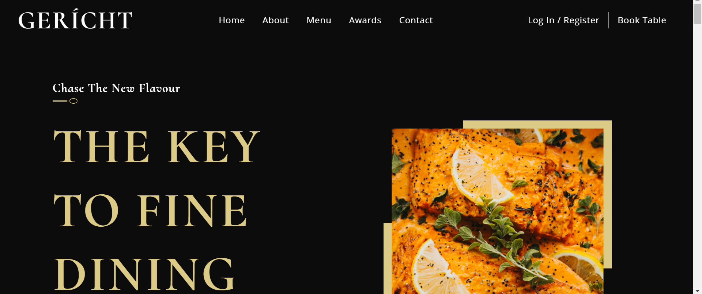

# 🍽️ GERICHT | Restaurant Website

## 🧾 Overview
A fully responsive restaurant website designed to showcase the restaurant’s services, menu, available dishes, and contact information. Built using modern web technologies to provide a smooth and intuitive user experience across all devices.

## ✨ Features
- Clean, elegant, and modern UI/UX design
- Fully responsive layout for mobile, tablet, and desktop
- Interactive sections: Hero, Menu, Services, and Contact
- Smooth scroll and section navigation
- Built with reusable and scalable front-end components

## 📸 Screenshot

## 🔗 Live Link
- Live Site URL: [Gericht Restaurant Website](https://gericht-restaurant-frontend-project.vercel.app/)

## 🛠️ Built With
- 💻 **HTML**
- 🎨 **CSS**
- ⚙️ **JavaScript**
- ⚛️ **React.js**

## 👨‍💻 Author

- **Name:** Nidhi Ramteke
- **LinkedIn:** [@nidhiramteke](https://www.linkedin.com/in/nidhi-ramteke-24nr/)
- **GitHub:** [@nidhiramteke011](https://github.com/nidhiramteke011)
